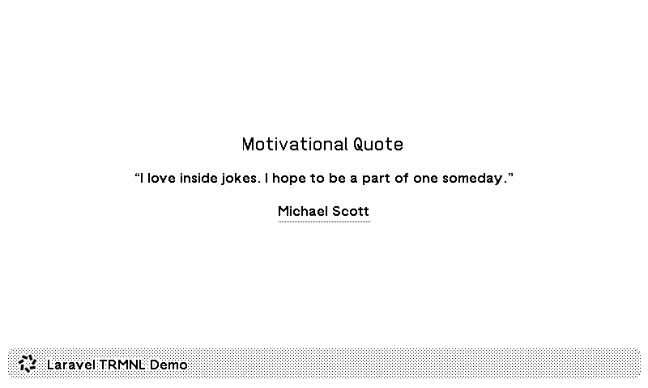

# Laravel TRMNL - Develop TRMNL plugins with Laravel


[](https://packagist.org/packages/bnussbau/laravel-trmnl)
[](https://github.com/bnussbau/laravel-trmnl/actions?query=workflow%3Arun-tests+branch%3Amain)
[](https://github.com/bnussbau/laravel-trmnl/actions?query=workflow%3A"Fix+PHP+code+style+issues"+branch%3Amain)
[](https://packagist.org/packages/bnussbau/laravel-trmnl)

Laravel TRMNL is a package designed to streamline the development of both public and private plugins for the [TRMNL](https://usetrmnl.com/?ref=laravel-trmnl) E-ink device. It supports data updates via webhooks or polling. For public plugins, it also provides built-in support for the TRMNL OAuth flow. Additionally, UI prototyping is made easier with the included Blade components.

If you are looking for a Laravel based TRMNL **Server implementation**, check out this repo: [github.com/bnussbau/laravel-trmnl-server](https://github.com/bnussbau/laravel-trmnl-server)



## Support ❤️
Support the development of this package by purchasing a TRMNL device through our referral link: https://usetrmnl.com/?ref=laravel-trmnl.
At checkout, use the code `laravel-trmnl` to receive a $15 **discount** on your purchase.

### Plugins built with Laravel TRMNL
* [trmnl-train-monitor](https://github.com/bnussbau/trmnl-train-monitor) by @bnussbau

## Features


- 🔌 Public and private plugin support [(docs)](https://help.usetrmnl.com/en/articles/10122094-plugin-recipes), [(docs)](https://docs.usetrmnl.com/go/plugin-marketplace/introduction)
- 🔄 Support for updates via webhooks or polling [(docs)](https://help.usetrmnl.com/en/articles/9510536-private-plugins)
- 🎨 Blade Components on top of the TRMNL Design System [(docs)](https://usetrmnl.com/framework)
- 🎯 OAuth integration support for public plugins [(docs)](https://docs.usetrmnl.com/go/plugin-marketplace/plugin-installation-flow)
- 📱 Render Helpers for responsive layouts

## Installation

You can install the package via composer:

```bash
composer require bnussbau/laravel-trmnl
```

### Optional Steps

#### Publish Config

Optionally, publish the config file using:

```bash
php artisan vendor:publish --tag="trmnl-config"
```

#### Publish Views

Optionally, publish the views using:

```bash
php artisan vendor:publish --tag="trmnl-views"
```

## Configuration

### Default Environment Variables

The package can be configured through environment variables:

```dotenv
TRMNL_PLUGIN_TYPE=              # private | public
TRMNL_DATA_STRATEGY=            # polling | webhook
TRMNL_WEBHOOK_URL=              # grab from TRMNL Dashboard [Private Plugins]
TRMNL_OAUTH_CLIENT_ID=          # grab from TRMNL Dashboard [Public Plugins]
TRMNL_OAUTH_CLIENT_SECRET=      # grab from TRMNL Dashboard [Public Plugins]
```

## Plugin Development

## Private Plugins
By default, plugins are private. To configure your settings, add the following environment variables to your `.env` file:
```dotenv
TRMNL_PLUGIN_TYPE=private
TRMNL_DATA_STRATEGY=webhook # or polling
TRMNL_WEBHOOK_URL=          # grab from TRMNL Dashboard if using webhook
```

### Update Data
Laravel TRMNL provides the `UpdateScreenContentJob` to facilitate sending data updates to TRMNL servers. 

#### Example usage
```php
UpdateScreenContentJob::dispatchSync([
    'key' => 'value',
    // ... other variables
]);
```

### Example using a Model and Pagination
```php
UpdateScreenContentJob::dispatchSync(
    Journey::whereNotIn('track', [1, 2])
        ->whereBetween('timestamp_planned', [now()->setTimezone('Europe/Vienna')
            ->addMinutes(15), now()->setTimezone('Europe/Vienna')->addHours(2)])
        ->paginate(8)
        ->toArray()
);
```        

Use the markup editor on the TRMNL private plugin webapp or use the `stripMarkup()` Method on the `Trmnl` 
Facade to render markup which you can copy into the editor. See Section Blade Components. 

## Public Plugins
Refer to the [“Plugin Marketplace” section](https://docs.usetrmnl.com/go/plugin-marketplace/introduction) in the TRMNL documentation, paying close attention to the authentication flow. 
Always verify the authorization token for incoming requests to prevent security issues. You can use `Auth::guard('trmnl')` to verify.

### Configuration

```dotenv
TRMNL_PLUGIN_TYPE=public
TRMNL_OAUTH_CLIENT_ID=          # grab from TRMNL Dashboard
TRMNL_OAUTH_CLIENT_SECRET=      # grab from TRMNL Dashboard
```
### Publish & Run Migrations

Publishes the database table required for storing authentication data.

```bash
php artisan vendor:publish --tag="trmnl-migrations"
php artisan migrate
```

### Render Markup

Public plugins need to provide a render endpoint, which returns markup for all screen layouts.
You can use the `Trmnl::renderScreen()` as helper.

```php
Route::post('/render', function () {

    // validate Authorization
    if (! Auth::guard('trmnl')->validate()) {
        return response()->json(['error' => 'Unauthorized'], 401);
    }

    return response()->json(
        Trmnl::renderScreen(
            'trmnl.full',
            'trmnl.half_horizontal',
            'trmnl.half_vertical',
            'trmnl.quadrant'
        )
    );
})->name('trmnl.render');
// make sure to not verify CSRF Token for this route
// ->withoutMiddleware([Illuminate\Foundation\Http\Middleware\VerifyCsrfToken::class])
```

## Publish

Run command `php artisan trmnl:plugin:configuration` to print the URLs required for plugin submission.

## Blade Components
- [see TRMNL Design System](https://usetrmnl.com/framework)
- [resources/views/components](resources/views/components)

Blade Compontens can help you generate markup code. Alternatively you can just use the native CSS classes from the TRMNL Design System.

### Usage

### Basic Layout

```blade
<x-trmnl::view>
    <x-trmnl::layout>
        <!-- Your content here -->
    </x-trmnl::layout>
    <x-trmnl::title-bar/>
</x-trmnl::view>
```

### Quote Example

```blade
<x-trmnl::view>
    <x-trmnl::layout>
        <x-trmnl::markdown gapSize="large">
            <x-trmnl::title>Motivational Quote</x-trmnl::title>
            <x-trmnl::content>“I love inside jokes. I hope to be a part of one someday.”</x-trmnl::content>
            <x-trmnl::label variant="underline">Michael Scott</x-trmnl::label>
        </x-trmnl::markdown>
    </x-trmnl::layout>
    <x-trmnl::title-bar/>
</x-trmnl::view>
```

## Testing

```bash
composer test
```

[//]: # (## Changelog)

[//]: # ()
[//]: # (Please see [CHANGELOG]&#40;CHANGELOG.md&#41; for more information on what has changed recently.)

[//]: # ()
[//]: # (## Contributing)

[//]: # ()
[//]: # (Please see [CONTRIBUTING]&#40;CONTRIBUTING.md&#41; for details.)

[//]: # ()
[//]: # (## Security Vulnerabilities)

[//]: # ()
[//]: # (Please review [our security policy]&#40;../../security/policy&#41; on how to report security vulnerabilities.)

## Credits

- [Benjamin Nussbaum](https://github.com/bnussbau)
- [All Contributors](../../contributors)

## License

The MIT License (MIT). Please see [License File](LICENSE.md) for more information.
